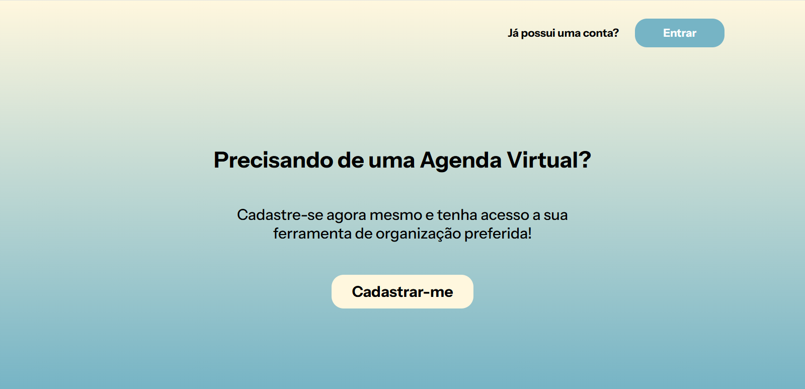
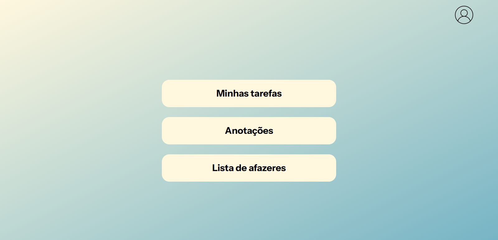
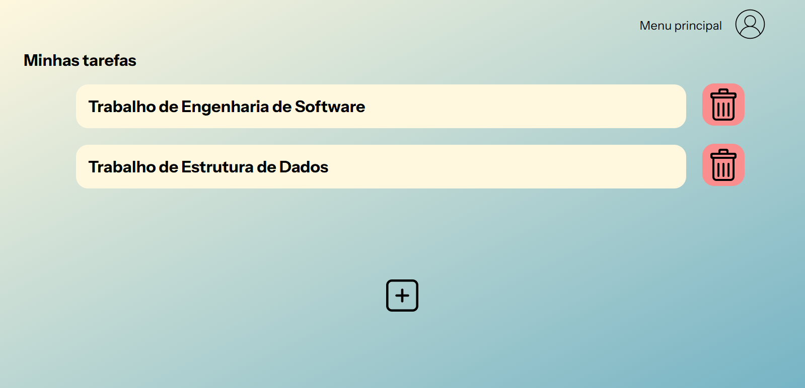
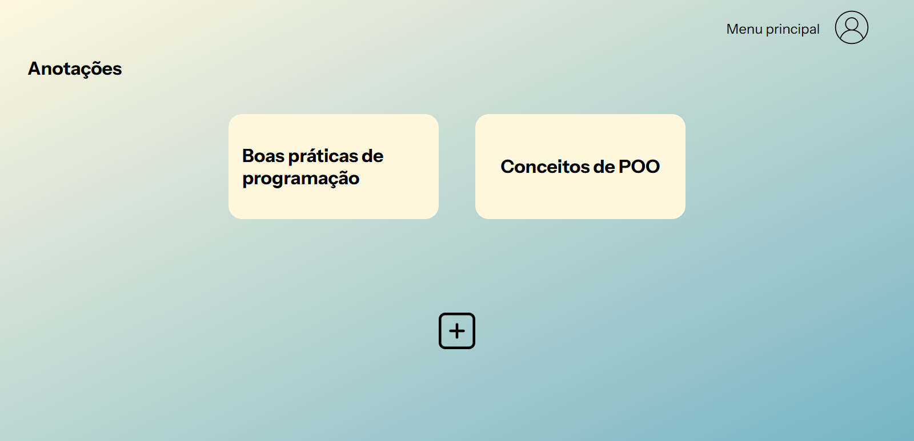
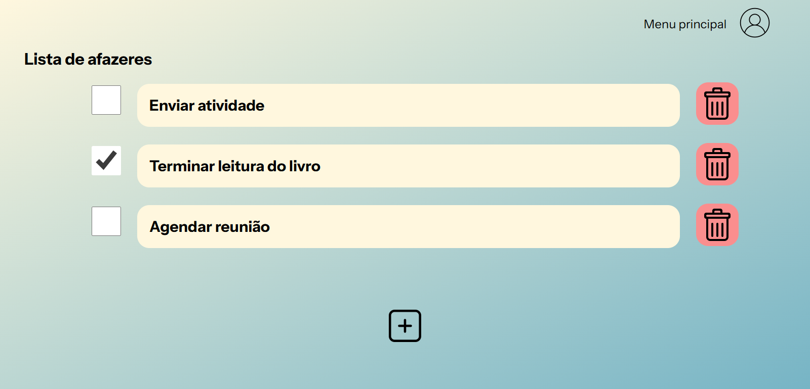

<h1 align="center">Sistema Agenda</h1>

O Sistema Agenda é um software de organização pessoal que permite que usuários gerenciem suas tarefas e compromissos, além de fazerem anotações, tudo em um único ambiente.

  
  
  
  
  

<h2>Objetivo:</h2>

Fornecer um sistema web que permita que usuários criem suas tarefas, façam anotações e utilizem um checklist.

<h2>Funcionalidades:</h2>
<ul>
  <li>Cadastro, login e logout de usuários;</li>
  <li>Exclusão de conta;</li>
  <li>Criar, editar e excluir tarefas;</li>
  <li>Criar, editar e excluir anotações;</li>
  <li>Criar e excluir itens em checklist.</li>
</ul>

<h2>Demonstração do sistema:</h2>
<h3>Página inicial:</h3>

  
  
Página que é exibida assim que o sistema é acessado, nela contém as opções "Cadastrar-me" (criar conta) e "Entrar" (fazer login).

<h3>Menu principal:</h3>

  
  
Página com opções que é exibida assim que o usuário realiza login.

<h3>Página de tarefas:</h3>

  
  
Página com as tarefas criadas pelo usuário (ao clicar na tarefa pode-se visualizar mais detalhes sobre ela, bem como a opção de editá-la).

<h3>Página de anotações:</h3>

  
  
Página com anotações (para visualizar seu conteúdo, basta clicar em cima da anotação).

<h3>Página de checklist (lista de afazeres):</h3>

  
  
Página com lista de afazeres, possibilitando marcar ou desmarcar itens.

<h2>Tecnologias utilizadas:</h2>
<ul>
  <li><b>Front-end:</b> HTML5, CSS3 e JavaScript;</li>
  <li><b>Back-end:</b> PHP 8.2;</li>
  <li><b>Banco de dados:</b> MariaDB 10.4 (compatível com MySQL).</li>
</ul>

<h2>Como executar:</h2>
<h3>1. Clone o repositório:</h3>

git clone https://github.com/thamiresm-dev/Sistema-Agenda.git

<h3>2. Crie o banco de dados:</h3>

No MariaDB/MySQL crie um banco chamado 'sistema-agenda';

<h3>3. Importe a estrutura do banco:</h3>

Arquivo 'sistema-agenda.sql' que está na pasta 'database';

<h3>4. Configure as credenciais:</h3>

Se necessário, ajuste o arquivo de conexão com o banco de dados (por padrão roda localmente com usuário root, sem senha).

<h3>5. Inicie o servidor local:</h3>

Abra o XAMPP, inicie o Apache e o MySQL e acesse o projeto pelo navegador.

<h2>Boas práticas:</h2>
<ul>
  <li>Senhas armazenadas com password_hash();</li>
  <li>Verificação de senhas com password_verify();</li>
  <li>Uso de Prepared Statements;</li>
  <li>Proteção de páginas com controle de sessão.</li>
</ul>

<h2>Autora:</h2>

Thamires Marques A.

